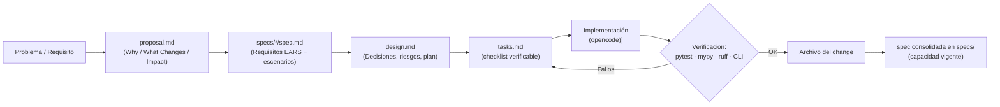
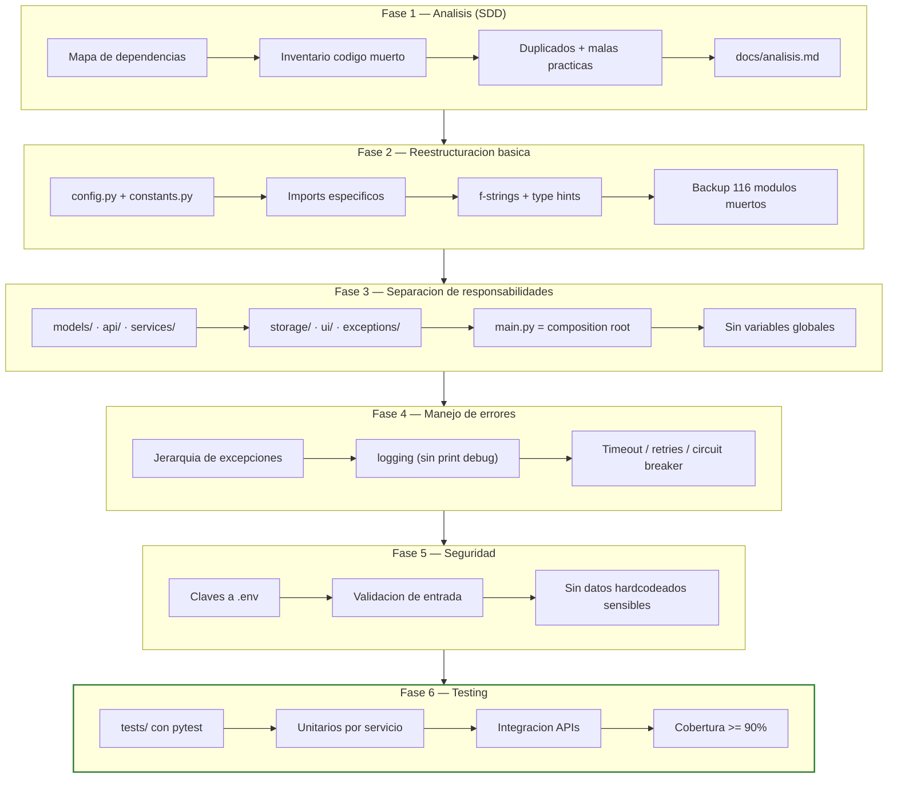
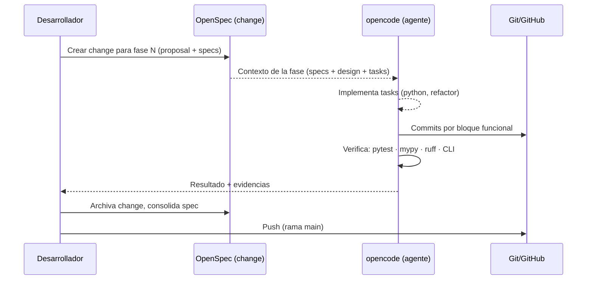
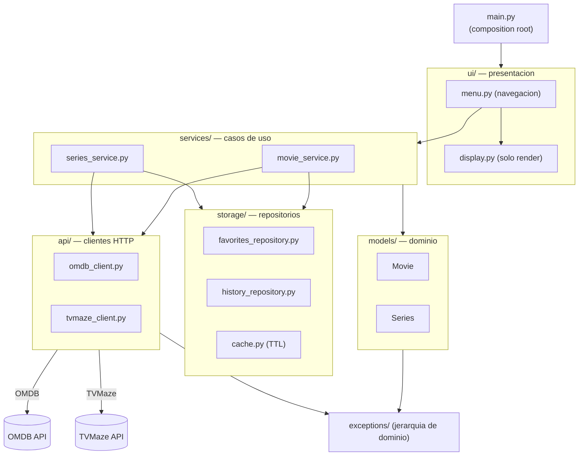

# Repositorio de Refactorización — `refactorizar_repo`

Repositorio educativo sobre **ingeniería inversa y refactoring de código legacy en Python**, donde el desarrollo se conduce mediante **Desarrollo Dirigido por Especificaciones (SDD)** con **OpenSpec** y asistencia de herramientas de IA (`opencode`).

El objetivo central es transformar una aplicación de consola en un proyecto bien estructurado (software con buenas prácticas): paquetes claros, tipado estricto, manejo de errores explícito, seguridad básica y una suite de pruebas automatizadas.

---

## 1. ¿Qué se refactoriza?

### 1.1 Proyecto principal — "Películas y Series" (CLI)

`refactorizar/proyecto_refactoring/proyecto_refactoring/`

Aplicación de línea de comandos que consulta películas y series usando APIs públicas (**OMDB** y **TVMaze**).

**Antes del refactoring**

```text
118 archivos .py
~19 100 líneas de código
116 módulos eran código muerto o duplicados (≈96 % de las líneas)
0 tests
Sin git
```

De los 118 módulos, la **cadena viva** es solo:

| Módulo | Líneas | Problemas principales |
|---|---|---|
| `main.py` | 334 | UI + menú + negocio mezclado, 10 `except:` desnudos, 31 concatenaciones, 73 `print()`, `from api_movies import *` |
| `api_movies.py` | 187 | HTTP + negocio + estado global (`PELICULAS_FAVORITAS`, `HISTORIAL_BUSQUEDAS`, `CACHE_*`), 7 `global`, key hardcodeada |

El resto era: 88 módulos `*_config.py`, 23 `*_manager.py` (muchos duplicados: `logger.py` vs `log_manager.py` vs `log_config.py`; `config_manager.py` vs `config_manager_v2.py`; `app.py` vs `main.py`), y `utils.py`.

### 1.2 Ejercicios de apoyo (mismo repo)

| Carpeta | Descripción |
|---|---|
| `nomina1.py` → `nomina1_optimized.py` | Script de cálculo de nómina mensual con malas prácticas (variable global, `print()` por fila, escritura línea a línea). Versión optimizada con **Python puro**, sin dependencias. Incluye `benchmark_payroll.py` y `benchmark_report.md`. |
| `factorizar/` | Ejemplos completos con tests: `purchase_processor` y `sensor_telemetry`, con `pyproject.toml`, pytest y coverage. |

---

## 2. Objetivos del refactoring

Objetivo general: **convertir código legacy no mantenible en un proyecto estructurado, probado y con buenas prácticas**, manteniendo el comportamiento visible idéntico.

| # | Objetivo | Métrica / evidencia |
|---|---|---|
| 1 | Eliminar código muerto y duplicado | 116 módulos aislados movidos a `codigo_muerto_bak/` (fase 2) |
| 2 | Configuración y constantes centralizadas | Un `config.py` (dataclass validada) + `constants.py` en lugar de 88 `*_config.py` |
| 3 | Separación de responsabilidades (SOLID + DDD local) | Paquetes `models/`, `api/`, `services/`, `storage/`, `ui/`, `exceptions/` |
| 4 | Eliminar estado global | Repositorios con inyección de dependencias desde `main.py` |
| 5 | Manejo de errores robusto | Jerarquía de excepciones, `logging`, sin `except:` desnudos |
| 6 | Seguridad básica | Claves en variables de entorno (`.env`), validación de entrada |
| 7 | Testing automatizado | Suite `pytest` con cobertura ≥ 90 % |
| 8 | Calidad de código | `mypy --strict` limpio, `ruff check` sin errores, f-strings |
| 9 | Documentación y control de versiones | REPO en Git + GitHub, README, specs OpenSpec |

---

## 3. Tecnologías utilizadas

### Lenguaje y runtime

- **Python 3.11+** (proyecto) / 3.12 (benchmarks nómina)
- **`requests`** como cliente HTTP síncrono (se mantiene; sin asyncio a propósito)

### Calidad y pruebas

| Herramienta | Uso |
|---|---|
| `pytest` + `coverage` | Tests unitarios e integración, umbral de cobertura ≥ 90 % |
| `mypy --strict` | Verificación estática de tipos |
| `ruff` | Lint / formateo rápido (línea única, estilo en `pyproject.toml`) |
| `black` | Formateo opcional consistente |

### Proceso y herramientas de desarrollo

| Herramienta | Uso |
|---|---|
| **OpenSpec** | Flujo *spec-driven*: cada fase de refactoring es un "change" con `proposal → specs → design → tasks` |
| **SDD** (Spec-Driven Development) | Las especificaciones dirigen el código; los requisitos se escriben en formato EARS |
| **opencode** | Asistente de IA (agentes + skills) que ejecuta los cambios |
| **Skills de opencode** | 66 skills instaladas localmente en `.opencode/skills/` |
| **Git / GitHub** | Versionado e historial; rollback por `git checkout` de la fase previa |
| Mermaid | Diagramas de flujo y arquitectura en la documentación |

### Skills de opencode instaladas (`.opencode/skills/`)

El proyecto tiene **66 skills** de opencode instaladas localmente que guían la ejecución del refactoring. Las de mayor relevancia para este repo:

| Skill | Uso en el proyecto |
|---|---|
| `legacy-modernizer` | Estrategia incremental para modernizar el código legacy (flujo *branch by abstraction*) |
| `spec-miner` | Ingeniería inversa: extraer especificaciones del código original (análisis de `main.py`/`api_movies.py`) |
| `code-reviewer` | Revisión de diffs y detección de *code smells* al avanzar por fases |
| `test-master` | Diseño de la suite `pytest` (fase 6) y estrategia de cobertura |
| `python-pro` | Estándares Python 3.11+, type hints y buenas prácticas |
| `debugging-wizard` | Diagnóstico de errores durante la migración |
| `secure-code-guardian` | Seguridad (fase 5): validación de entrada, manejo de claves |
| `prompt-engineer` | Redacción de prompts estructurados para guiar a la IA |
| `the-fool` | Crítica estructurada / *red team* de las decisiones de diseño |

> Las skills instaladas provienen de la librería **[jeffallan/opencode-skills](https://github.com/jeffallan/opencode-skills)** (v0.5.0, 66 skills). La carpeta local `.opencode/` queda excluida del control de versiones (`.gitignore`).

---

## 4. Flujo de desarrollo: SDD + OpenSpec

**SDD (Spec-Driven Development)** plantea que el código se escribe para *satisfacer una especificación*, no a partir de la intuición. **OpenSpec** materializa ese flujo en artefactos versionables dentro de `openspec/`:

```text
openspec/
├── config.yaml                  # Contexto del proyecto + reglas
├── specs/                       # Capacidades consolidadas (vigentes)
│   └── codebase-analysis/spec.md
└── changes/                     # 1 change por fase de refactoring
    ├── fase-1-analisis-codigo/          (archivado)
    ├── fase-2-reestructuracion-basica/  (archivado)
    ├── fase-3-separacion-responsabilidades/
    │   ├── proposal.md
    │   ├── specs/*/spec.md             (Requisitos EARS)
    │   ├── design.md
    │   └── tasks.md
    ... fase-4, fase-5, fase-6
```

### Ciclo de vida de un *change*



### Flujo de refactoring en 6 fases



> Cada fase es un **change OpenSpec** independiente: se propone, especifica, diseña, implementa y archiva. Los cambios archivados consolidan sus requisitos en `openspec/specs/`.

---

## 5. Cómo se refactoriza el desarrollo

Reglas que guían la ejecución del refactoring:

1. **Comportamiento idéntico**: la salida del código refactorizado debe ser equivalente a la original (en nómina se valida *byte a byte*, ver `benchmark_report.md`).
2. **Migración incremental, nunca *big-bang***: por funcionalidad (buscar → favoritos → historial → export/import) verificando tras cada bloque.
3. **Un cambio por fase**: cada fase tiene su fichero OpenSpec con alcance y *non-goals* explícitos.
4. **Rollback seguro**: git permite volver a la fase previa con `git checkout` si algo se rompe.
5. **Calidad medida**: `compileall`, `ruff check`, `mypy --strict` y `pytest` habilitan un *quality gate* por fase.
6. **Sobriedad**: sin abstracciones forzadas (sin interfaces innecesarias en una app CLI); los *protocols* se introducen solo si la inyección de dependencias lo exige.

### Flujo de trabajo integrado



### Arquitectura objetivo (fase 3)



---

## 6. Estructura del repositorio

```text
refactorizar_repo/
├── README.md                        # Este documento
├── .gitignore
├── .opencode/skills/                # 66 skills de opencode (local, ignorado por git)
├── factorizar/                      # Ejemplos refactorizados con tests
│   ├── src/purchase_processor.py
│   ├── src/sensor_telemetry.py
│   ├── tests/ · pyproject.toml · REFACTORING_REPORT.md
├── refactorizar/
│   ├── proyecto_refactoring/        # Proyecto principal (CLI Películas y Series)
│   │   ├── proyecto_refactoring/    # Código vivo: main.py, api_movies.py, config.py, constants.py
│   │   ├── codigo_muerto_bak/       # Backup de los 116 módulos eliminados
│   │   ├── openspec/                # Capacidades + changes de cada fase
│   │   ├── docs/analisis.md         # Hallazgos de la fase 1
│   │   ├── docs/informe-ejecutivo.md  # Informe ejecutivo fases 1-4
│   │   └── pyproject.toml
├── nomina1.py                       # Ejercicio nómina (a refactorizar)
├── nomina1_optimized.py             # Versión optimizada (Python puro)
├── benchmark_payroll.py / benchmark_report.md / benchmark_results.json
└── payroll_output(_optimized).txt   # Salidas generadas
```

---

## 7. Cómo ejecutar y verificar

### Proyecto Películas y Series

```bash
cd refactorizar/proyecto_refactoring/proyecto_refactoring
python main.py
```

Calidad:

```bash
ruff check .                            # Lint
mypy --strict .                         # Tipado estricto
pytest                                  # Tests (fase 6)
```

### Ejercicio nómina

```bash
python nomina1.py                       # Original (salida a payroll_output.txt)
python nomina1_optimized.py             # Optimizado (salida a payroll_output_optimized.txt)
python benchmark_payroll.py             # Benchmark comparativo
```

---

## 8. Estado actual de las fases

| Fase | Change OpenSpec | Estado |
|---|---|---|
| 1 — Análisis del código | `fase-1-analisis-codigo` | Archivado |
| 2 — Reestructuración básica | `fase-2-reestructuracion-basica` | Archivado |
| 3 — Separación de responsabilidades | `fase-3-separacion-responsabilidades` | Archivado |
| 4 — Manejo de errores | `fase-4-manejo-errores` | Archivado |
| 5 — Seguridad | `fase-5-seguridad` | Archivado |
| 6 — Testing | `fase-6-testing` | Archivado |

📈 [Informe ejecutivo fases 1-4](refactorizar/proyecto_refactoring/docs/informe-ejecutivo.md): qué se realizó y qué se mejoró.